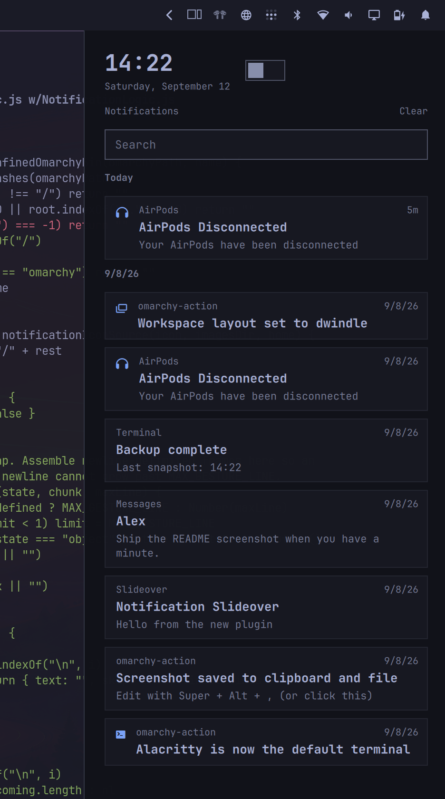
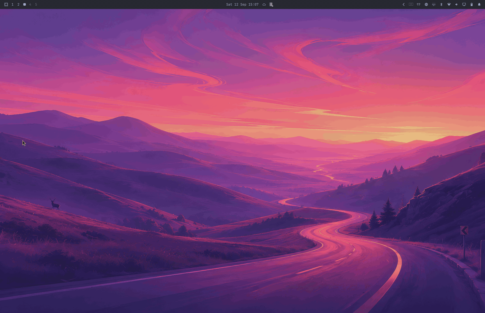

# Notification Slideover

A notification history sheet for [Omarchy](https://omarchy.org/). It slides in from the right and **does not move your windows**.

It uses Omarchy’s built-in `omarchy.notifications` service. It does not replace the notification daemon and does not replay old toasts as new popups.

Author: [Steven Bower](https://github.com/BluSyn) · Co-author: Grok (xAI)





Click a row to jump to the app. Hover ✕ to dismiss one. **Clear** wipes live toasts and saved history. **Esc** or a click outside closes the sheet. The sheet slides in from the right; tiled windows stay put.

---

## 1. Install the plugin

Works on every Omarchy machine.

```bash
omarchy plugin add https://github.com/BluSyn/omarchy-notification-slideover.git --enable
```

Check it loaded:

```bash
omarchy plugin list | grep slideover
omarchy-shell shell toggle blusyn.notification-slideover '{}'
```

You should see `blusyn.notification-slideover` **enabled**, and the sheet should open. Close it with Esc.

Omarchy plugins **cannot** write `~/.config/hypr`. The next section is the only extra step, and it depends on how you use the machine.

### Remove

```bash
omarchy plugin remove blusyn.notification-slideover
```

That disables the overlay and deletes the plugin folder. It does **not** edit Hyprland. If you added a `Super+period` bind, a four-finger gesture, or a `dofile(.../contrib/hyprland.lua)` line, delete those from `~/.config/hypr/bindings.lua` and `~/.config/hypr/input.lua` yourself, then `hyprctl reload`.

---

## 2. Choose how you open it

| Your machine | What to set up |
| --- | --- |
| **Any PC, VM, or laptop** | Keyboard shortcut (recommended) and/or mouse drag |
| **Laptop with a real multitouch pad** (Apple, Synaptics, ELAN, ALPS, …) | Same as above, plus two-finger edge swipe (built in) |
| **Want a Mac-style extra gesture** | Optional four-finger swipe in Hyprland |

You can enable more than one.

### Keyboard — all devices

This is the path if you have no trackpad.

1. See if the key is free:

   ```bash
   omarchy menu keybindings --print | grep -i period
   ```

2. If `SUPER + period` is already listed, add this **above** the new bind in `~/.config/hypr/bindings.lua`:

   ```lua
   hl.unbind("SUPER + period")
   ```

   (`Super` is the Cmd key on a Mac keyboard.)

3. Add the bind:

   ```lua
   o.bind(
     "SUPER + period",
     "Notification slideover",
     "omarchy-shell shell toggle blusyn.notification-slideover '{}'"
   )
   ```

4. Save. Hyprland reloads on save. Confirm:

   ```bash
   hyprctl reload
   hyprctl configerrors
   omarchy menu keybindings --print | grep -i slideover
   ```

You should see `SUPER + PERIOD → Notification slideover`.

### Mouse — all devices

No config. Drag inward from the **right edge of the screen**. Drag the sheet’s left edge the other way to close it.

### Trackpad — laptops

Two-finger swipe is **built into the plugin**. No Hyprland bind.

- **Open:** two fingers start on the **right-most strip of the pad**, swipe left. The sheet follows your fingers.
- **Close:** two-finger swipe right while it is open.

This is not Apple-only. Linux `ABS_MT` clickpads (Apple SPI / Magic Trackpad, Synaptics, ELAN, ALPS, HID precision pads) are picked up automatically.

You need:

1. To be in the `input` group (Omarchy default). Check with `groups`. If you just added yourself, log out and back in.
2. `python-libevdev` (only for this swipe):

   ```bash
   omarchy pkg add python-libevdev
   omarchy restart shell
   ```

   Without that package, keyboard and mouse still work.

See what the watcher will use:

```bash
python3 ~/.config/omarchy/plugins/blusyn.notification-slideover/gesture.py --list
```

A line starting with `watch` is your pad. If every line is `skip`, use the keyboard or mouse instead.

Do **not** add a two-finger bind in Hyprland — that steals scrolling. Edge-swipe is read from the pad directly.

### Optional: four-finger swipe

Works on any pad libinput already uses for 3/4-finger gestures. Add to `~/.config/hypr/input.lua`:

```lua
hl.gesture({
  fingers = 4,
  direction = "left",
  action = function()
    hl.dispatch(hl.dsp.exec_cmd("omarchy-shell shell toggle blusyn.notification-slideover '{}'"))
  end,
})
hl.gesture({
  fingers = 4,
  direction = "right",
  action = function()
    hl.dispatch(hl.dsp.exec_cmd("omarchy-shell shell toggle blusyn.notification-slideover '{}'"))
  end,
})
```

### One-file shortcut

`contrib/hyprland.lua` is the keyboard bind plus the four-finger swipe. Copy the bits you want, or load the whole file from `~/.config/hypr/bindings.lua`:

```lua
dofile(os.getenv("HOME") .. "/.config/omarchy/plugins/blusyn.notification-slideover/contrib/hyprland.lua")
```

`dofile` tracks plugin updates. A copy-paste still works if you later remove the plugin.

---

## Troubleshooting

**The keybind does nothing.**  
`omarchy plugin list` should show the plugin enabled. This should still open it:

```bash
omarchy-shell shell toggle blusyn.notification-slideover '{}'
```

If that works, the Hyprland bind is wrong or the key is still used by something else (`omarchy menu keybindings --print`).

**Two-finger swipe does nothing; the keybind works.**  
Run `gesture.py --list`. No `watch` line means the pad is not true multitouch (or is a touchscreen). Use keyboard or mouse.

**`--list` says `unreadable` on `/dev/input/event*`.**  
`groups` must include `input`. Log out after adding the group.

**The sheet covers a few pixels of the bar, or ignores a left/bottom bar.**  
It reads Hyprland’s reserved edge. Restart the shell if you just moved the bar: `omarchy restart shell`.

**A little scroll leaks at the start of an edge swipe.**  
Expected. The watcher only observes the pad; it never grabs it.

**A plugin update did not change my shortcut.**  
Intended. Hyprland binds live in your config, not in the plugin.

---

## Notes

- Overlay layer, no exclusive zone — tiled windows stay put.
- The sheet is ~98% opaque, using the theme background (shifted toward black or white for contrast).
- History is Omarchy’s. Dismissing one historical row deletes `~/.local/state/omarchy/notifications/history/<timestamp>-<id>.json` when the service has no per-item API.

## Development

```bash
node --test tests/test_logic.js
python3 tests/test_gesture.py
python3 tests/test_tree.py
omarchy plugin validate .
```

Contributor notes live in `DEVELOPMENT.md`. Do not add `AGENTS.md` or other
agent-instruction files; the tree test rejects them.

Edits under this folder hot-reload. `omarchy restart shell` if the gesture watcher gets stuck.

## Security

Runs unsandboxed inside `omarchy-shell`. The trackpad watcher is observe-only (no `EVIOCGRAB`). Only install from a source you trust.

Notification app, summary, glyph and body are ingested with length/control caps and rendered as `Text.PlainText`, so markup in a toast cannot become a fetch. Dismissing a historical row deletes only `$HOME/.local/state/omarchy/notifications/history/<digits>-<digits>.json` and the matching `images/<stem>-appIcon` / `images/<stem>-image` copies; any other path is refused. The gesture helper emits bounded JSON (`amount` in 0–1, clamped velocity, short lines). The overlay reads the watcher as raw chunks and assembles frames itself, so a write without a newline cannot grow past 256 bytes. IPC on `notification-slideover` is parameterless (`state`, `ping`).

## License

MIT
